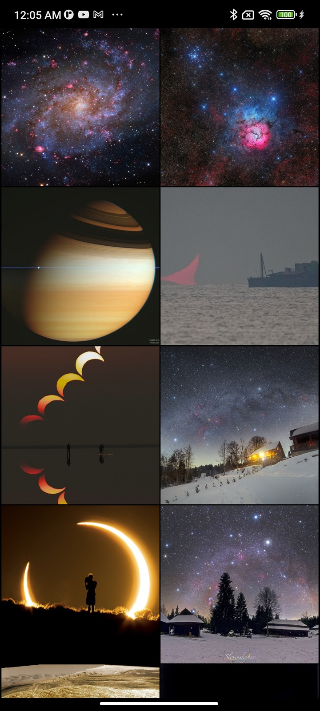
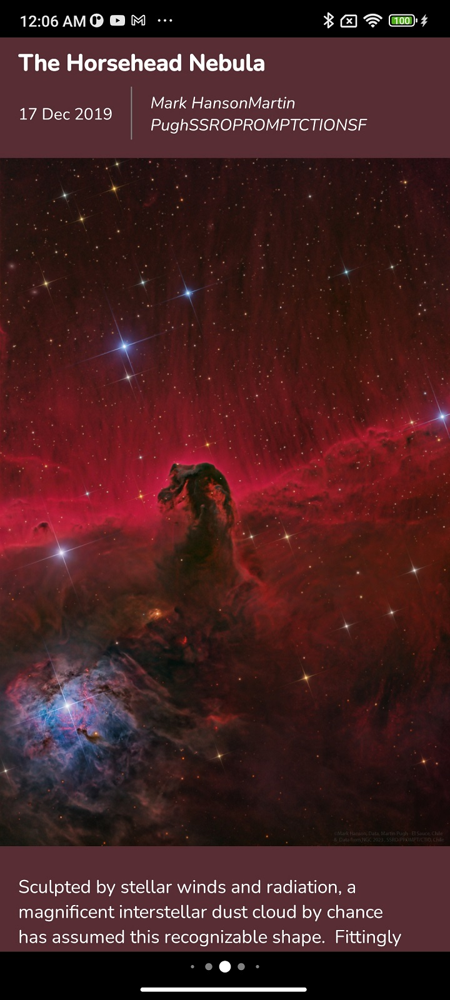
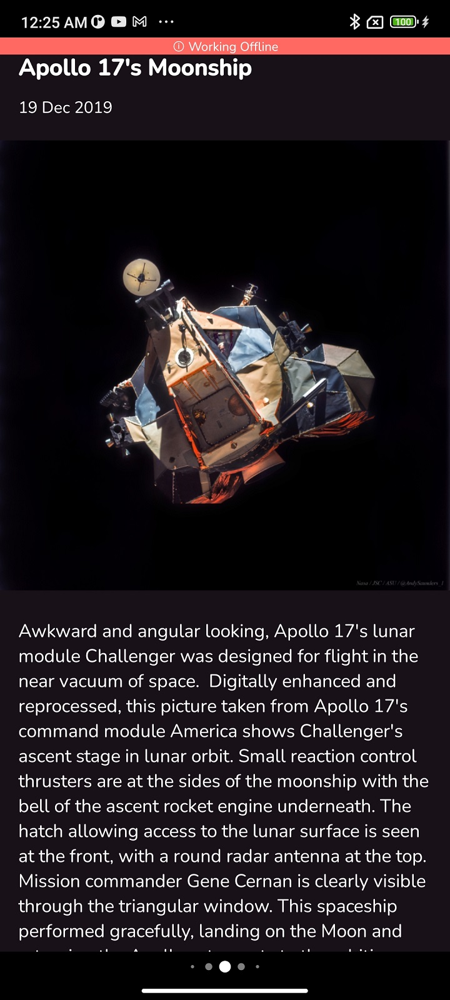
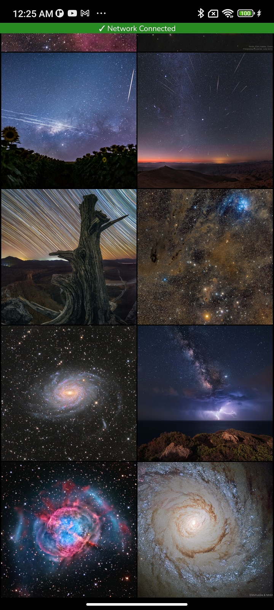

# APoD
Android application that loads a json file with details form NASA's Astronomy Picture of the Day.

Created as part of the hiring process at Obvious

# Screens Requirements
1. **Images Grid Screen** 
Home screen to show a scrollable grid of pictures starting with the latest images first, on launching the app. 
Tapping on an image should open the image detail screen.

2. **Image Detail Screen** 
Screen for displaying the full size image along with the metadata like title, description, etc. 
Also with the ability to swipe to previous or next images from this screen itself.

# Screenshots
<table style="width:100%">
  <tr>
    <td></td>
    <td></td>
    <td></td>
    <td></td>
  </tr>
</table>